# SWIP - SafePackage Workflow Integration Platform

A Next.js application for customs screening and international shipment management. SWIP streamlines the process of screening packages for customs compliance, managing shipments, and coordinating with CBP (U.S. Customs and Border Protection).

## Overview

SWIP integrates with the **SafePackage API** to provide a complete workflow for:
- **Batch screening** of packages via CSV upload
- **Real-time validation** of shipment data
- **Customs decision management** (accepted, rejected, inconclusive, audit required)
- **Shipment consolidation** and CBP verification
- **Document generation** (commercial invoices, packing lists)
- **Audit logging** of all data changes

```mermaid
graph TD
    A["<b>SWIP</b><br/>Customs Screening Platform"] --> B["📤 Upload Phase"]
    A --> C["🔍 Screening Phase"]
    A --> D["📦 Package Management"]
    A --> E["✈️ Shipment Management"]

    B --> B1["CSV Upload"]
    B --> B2["Row Validation"]
    B --> B3["Bulk/Row Editing"]

    B1 --> B4["Parse CSV<br/>Papa Parse"]
    B4 --> B2
    B2 --> B5["Schema Validation<br/>Zod"]
    B5 --> B3
    B3 --> B6["Review & Submit"]

    C --> C1["SafePackage API<br/>Product Screening"]
    C --> C2["SafePackage API<br/>Package Screening"]
    C1 --> C3["Product Decision<br/>Accepted/Rejected"]
    C2 --> C3
    C3 --> C4["Store Results"]

    D --> D1["View Packages"]
    D --> D2["Package Details"]
    D --> D3["Audit Images"]
    D --> D4["Duty Payment"]

    E --> E1["Register Shipments"]
    E --> E2["Verify with CBP"]
    E --> E3["Generate Docs"]

    B6 --> API["SafePackage Client<br/>REST API Calls"]
    C2 --> API
    E1 --> API
    E2 --> API

    API --> DB[(Supabase DB<br/>PostgreSQL)]
    DB --> TABLES["Tables:<br/>uploads<br/>upload_rows<br/>packages<br/>products<br/>shipments<br/>profiles"]

    style A fill:#1a1a2e,stroke:#16213e,color:#fff
    style B fill:#16213e,stroke:#0f3460,color:#fff
    style C fill:#16213e,stroke:#0f3460,color:#fff
    style D fill:#16213e,stroke:#0f3460,color:#fff
    style E fill:#16213e,stroke:#0f3460,color:#fff
    style API fill:#0f3460,stroke:#533483,color:#fff
    style DB fill:#533483,stroke:#8e44ad,color:#fff
```



## Core Features

### 1. CSV Upload & Validation
- Drag-and-drop CSV upload interface
- Real-time validation using Zod schemas
- Row-by-row error reporting with specific field messages
- Individual row editing or bulk editing capabilities
- Full audit trail of all changes before submission

### 2. SafePackage Screening Integration
- Automated screening of packages against customs rules
- Product-level and package-level screening
- Image handling (product photos for visual inspection)
- Screening decision codes and reason descriptions
- QR code generation for labeled packages

### 3. Package Management Dashboard
- View all screened packages with decision status
- Filter by screening result (accepted, rejected, inconclusive, audit_required)
- Submit audit images when required
- Process duty payments
- Track package status through customs workflow

### 4. Shipment Management
- Register consolidated shipments containing multiple packages
- Verify shipments with CBP
- Generate customs documents automatically
- Track shipment verification status
- Monitor duty payment status

### 5. Audit & Compliance
- Complete audit log of row edits and bulk changes
- API request/response logging
- User action tracking
- Change history for regulatory compliance

## Tech Stack

**Frontend & Framework**
- **Next.js 16** with App Router
- **React 19** with Server Components
- **TypeScript** (strict mode)
- **Tailwind CSS v4** for styling
- **Radix UI** primitives + **shadcn/ui** components

**State Management & Forms**
- **Zustand** for client state
- **react-hook-form** with **@hookform/resolvers**
- **Zod** for schema validation

**Backend & Data**
- **Supabase** (PostgreSQL) for database
- **Node.js** runtime with API routes
- **SafePackage API** for customs screening and shipment management

**Utilities**
- **PapaParse** for CSV parsing
- **date-fns** for date formatting
- **qrcode** for QR code generation
- **xlsx** for spreadsheet operations

## Architecture

### Request Flow
```
CSV Upload → Parse → Validate Schema → Edit (optional) → Submit
    ↓
SafePackage API (Screen Package)
    ↓
Store Results in Supabase
    ↓
View Packages → Edit/Audit → Submit to Shipment
    ↓
SafePackage API (Register Shipment)
    ↓
Verify with CBP → Generate Docs
```

### Database Schema

**Core Tables**
- `profiles` - User accounts with company information
- `uploads` - CSV file upload tracking (status, row counts, validation results)
- `upload_rows` - Individual row validation status and errors
- `packages` - Screened packages with SafePackage reference IDs and decisions
- `products` - Product details (SKU, pricing, origin, categories)
- `package_products` - Junction table linking products to packages
- `shipments` - Consolidated shipments awaiting CBP verification
- `api_logs` - Audit trail of all SafePackage API interactions
- `api_configurations` - Stored API credentials per user (sandbox/production)

**Status Enums**
- `UploadStatus` - pending, validating, validated, validation_failed, processing, completed, completed_with_errors, failed
- `ScreeningStatus` - pending, accepted, rejected, inconclusive, audit_required
- `PackageStatus` - pending through registered (includes screening, audit, and duty payment stages)
- `ShipmentStatus` - pending, registered, verification_pending, verified, rejected, failed
- `RowStatus` - pending, valid, invalid, processing, processed, failed

## Directory Structure

```
src/
├── app/
│   ├── (auth)/              # Authentication routes (login, register)
│   ├── (dashboard)/         # Protected dashboard routes
│   │   ├── dashboard/       # Overview and statistics
│   │   ├── uploads/         # CSV upload and management
│   │   ├── packages/        # Package screening results
│   │   ├── shipments/       # Shipment consolidation and verification
│   │   └── settings/        # User settings and API configuration
│   ├── api/                 # Server-side API routes
│   │   ├── uploads/         # Upload processing endpoints
│   │   ├── packages/        # Package management endpoints
│   │   ├── exports/         # Document generation (invoices, packing lists)
│   │   └── safepackage/     # SafePackage API proxies
│   ├── layout.tsx           # Root layout with auth middleware
│   └── page.tsx             # Root redirect (login/dashboard)
├── components/
│   ├── layout/              # Navigation and page layouts
│   ├── uploads/             # CSV upload components (dropzone, preview, editor)
│   ├── packages/            # Package detail and list components
│   ├── ui/                  # Radix/shadcn UI primitives
│   └── ...
├── lib/
│   ├── supabase/            # Supabase client/server utilities
│   ├── safepackage/         # SafePackage API client and types
│   ├── csv/                 # CSV parsing and column constants
│   ├── validation/          # Zod schemas for all entities
│   ├── audit/               # Audit logging utilities
│   └── utils/               # Helper functions
├── types/
│   └── database.ts          # Auto-generated database types from Supabase
└── middleware.ts            # Auth middleware for protected routes
```

## Key Validation Rules

**CSV Column Requirements**
- Order identifiers: externalId, houseBillNumber, barcode
- Platform info: platformId (Amazon, Wish, eBay, etc.), sellerId
- Addresses: shipper/consignee name, address, city, state, postal code, country (3-letter ISO)
- Product details: SKU, name, description, URL, price
- Customs: HS code (6-10 digits), origin country, EAN/UPC
- Shipping: weight (kg/lbs), transport mode (AIR/TRUCK)

**Sanitization**
- Phone numbers: digits and hyphens only
- Postal codes: alphanumeric only
- HS codes: digits only, 6-10 characters
- Country codes: 3-letter ISO uppercase

## Getting Started

### Prerequisites
- Node.js 20+
- npm or yarn
- Supabase project (PostgreSQL database)
- SafePackage API credentials

### Environment Setup
```bash
# Copy environment template
cp .env.example .env.local

# Add your credentials:
# NEXT_PUBLIC_SUPABASE_URL=your_supabase_url
# NEXT_PUBLIC_SUPABASE_ANON_KEY=your_anon_key
# SAFEPACKAGE_API_URL=https://api.safepackage.com or sandbox
# SAFEPACKAGE_API_KEY=your_api_key
```

### Installation
```bash
npm install
```

### Development
```bash
npm run dev
```
Open [http://localhost:3000](http://localhost:3000) in your browser.

### Build & Production
```bash
npm run build
npm start
```

### Linting
```bash
npm run lint
```

## Deployment

Deploy on [Vercel](https://vercel.com) (recommended for Next.js):
```bash
vercel deploy
```

For other platforms, ensure:
- Node.js runtime support
- Environment variables configured
- Supabase connectivity
- SafePackage API access

## API Integrations

### SafePackage Client
Located in `src/lib/safepackage/client.ts`

**Key Methods**
- `getPlatforms()` - List supported e-commerce platforms
- `screenProduct(data)` - Screen individual product
- `screenPackage(data)` - Screen complete package (multi-product)
- `submitAudit(data)` - Submit audit images for failed packages
- `payDuty(data)` - Process customs duty payment
- `registerShipment(data)` - Register shipment consolidation
- `verifyShipment(data)` - Verify with CBP and get documents

### Database
- Supabase PostgreSQL with Row Level Security (RLS)
- Auth via Supabase Auth (email/password)
- Real-time capabilities available

## Development Guidelines

**Code Style**
- Use `@/*` path aliases for imports (maps to `src/*`)
- Use `cn()` from `@/lib/utils` for className merging
- Prefer named exports
- Follow Radix/shadcn component patterns for UI

**Validation**
- Always validate input with Zod schemas in `src/lib/validation/schemas.ts`
- Sanitize user input (phone, postal code, HS code)
- Validate CSV column names before processing

**Error Handling**
- Return structured error responses from API routes
- Log errors with context for debugging
- Show user-friendly messages via toast notifications

**Database**
- Migrations in `supabase/migrations/` (SQL)
- Use Supabase client for all DB operations
- Check RLS policies for data access

## Contributing

1. Create a feature branch
2. Follow code style guidelines
3. Test changes locally
4. Commit with clear messages
5. Submit PR for review

## License

Private - SWIP Project
